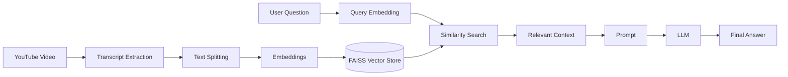
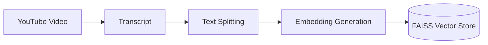
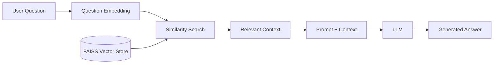
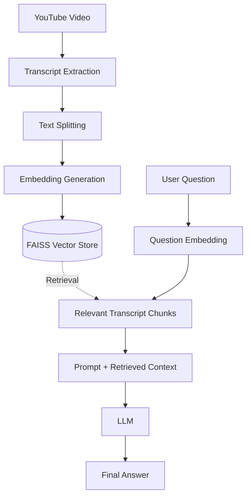
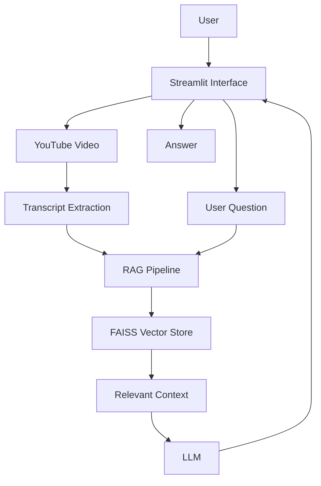
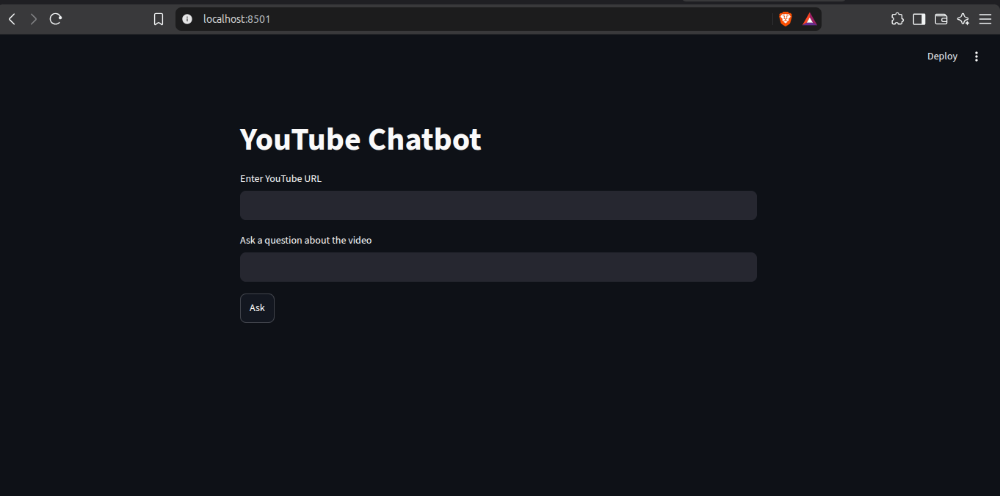
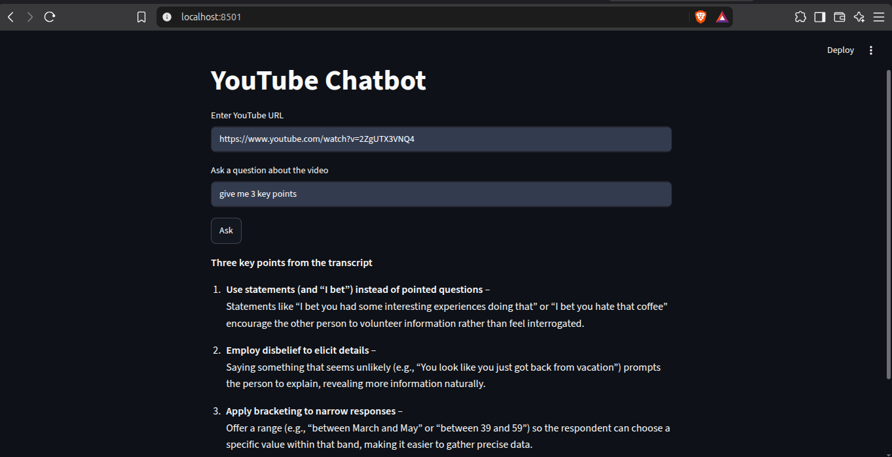

# YouTube Chatbot

### AI-powered YouTube Video Q&A using Retrieval-Augmented Generation

An AI-powered chatbot that allows users to ask questions about YouTube videos using **Retrieval-Augmented Generation (RAG)**.

The application extracts the video transcript, processes the content, creates embeddings, stores them in a vector store, retrieves relevant information, and uses an LLM to generate contextual answers.

---

## Tech Stack

<p align="center">


</p>

| Technology                 | Purpose                            |
| -------------------------- | ---------------------------------- |
| **Python**                 | Core application development       |
| **LangChain**              | LLM and RAG workflow orchestration |
| **FAISS**                  | Vector similarity search           |
| **Google Gemini**          | Embeddings and AI integration      |
| **Groq**                   | LLM inference                      |
| **YouTube Transcript API** | YouTube transcript extraction      |
| **Streamlit**              | Interactive user interface         |
| **python-dotenv**          | Environment variable management    |

---

## Overview

Traditional video search requires users to manually watch a video or search through its transcript.

This project provides a conversational interface where users can ask questions about a YouTube video and receive answers based on the video's actual transcript.

### Project Workflow



---

## Key Features

| Feature            | Description                                        |
| ------------------ | -------------------------------------------------- |
| YouTube Processing | Extracts transcript content from YouTube videos    |
| Text Processing    | Splits transcript content into manageable chunks   |
| Embeddings         | Converts text into semantic vector representations |
| Vector Search      | Retrieves relevant transcript content using FAISS  |
| RAG Pipeline       | Combines retrieved context with an LLM             |
| AI Responses       | Generates answers based on the video content       |
| Interactive UI     | Provides a Streamlit-based chat interface          |

---

## RAG Architecture

The system is divided into two main stages: **document ingestion** and **question answering**.

### Document Ingestion



### Question Answering



### Complete RAG Pipeline



---

## Application Architecture



This architecture separates the user interface from the RAG processing pipeline, making the application easier to understand and extend.

---

## Project Structure

```text
Youtube_chatbot/
│
├── backend/
│   └── RAG and backend logic
│
├── frontend/
│   └── User interface
│
├── .env.example
├── .gitignore
├── requirements.txt
└── README.md
```

---

## How the RAG Pipeline Works

```text
YouTube Video
      │
      ▼
Transcript Extraction
      │
      ▼
Text Splitting
      │
      ▼
Embedding Generation
      │
      ▼
FAISS Vector Store
      │
      │
      │  User Question
      │       │
      │       ▼
      │  Query Embedding
      │       │
      └───────┤
              ▼
       Similarity Search
              │
              ▼
      Relevant Context
              │
              ▼
        Prompt + Context
              │
              ▼
             LLM
              │
              ▼
        Final Answer
```

The key idea is that the LLM receives **relevant information retrieved from the video's transcript** before generating the response. This allows the chatbot to answer questions using the video's actual content.

---

## Technologies Used

### LangChain

Used to build and orchestrate the RAG and LLM workflow.

### FAISS

Used for efficient vector similarity search over the embedded transcript chunks.

### Google Gemini

Used for embedding and AI-related processing.

### Groq

Used for fast LLM inference.

### YouTube Transcript API

Used to retrieve transcript content from YouTube videos.

### Streamlit

Used to build the interactive frontend for the chatbot.

---

## Getting Started

### Clone the Repository

```bash
git clone https://github.com/junaidsheikh-dev/Youtube_chatbot.git
cd Youtube_chatbot
```

### Install Dependencies

```bash
pip install -r requirements.txt
```

### Environment Variables

Create a `.env` file using `.env.example` as a reference.

```env
GOOGLE_API_KEY=your_google_api_key
GROQ_API_KEY=your_groq_api_key
```

### Run the Application

Run the application using the project's frontend/backend entry points.

---

## What This Project Demonstrates

This project demonstrates practical implementation of:

* Retrieval-Augmented Generation
* Document processing and text chunking
* Text embeddings
* Vector similarity search
* FAISS vector stores
* LangChain workflows
* LLM integration
* Prompt and context engineering
* AI application development
* Frontend and AI backend integration

---

## Future Improvements

| Planned Improvement   | Purpose                                            |
| --------------------- | -------------------------------------------------- |
| Conversation Memory   | Maintain context across multiple questions         |
| Source References     | Display relevant transcript sections or timestamps |
| Multi-Video Support   | Allow questions across multiple YouTube videos     |
| Improved Retrieval    | Experiment with advanced retrieval strategies      |
| Streaming Responses   | Provide responses progressively                    |
| RAG Evaluation        | Measure retrieval and answer quality               |
| LangGraph Integration | Build more advanced AI workflows                   |
| Production Deployment | Make the application publicly accessible           |

---

## Screenshots


### YouTube Chat Interface

<p align="center">
  
</p>

### Question and Answer

<p align="center">
  
</p>

---

## Developer

### Junaid Sheikh

**Junior AI Engineer**

`AI Agents` · `RAG` · `Multi-Agent Systems` · `MCP` · `AI Automation`

[GitHub](https://github.com/junaidsheikh-dev) · [LinkedIn](https://www.linkedin.com/in/junaidsheikh-dev/)

---

## Project

If you find this project useful, consider giving the repository a star.
